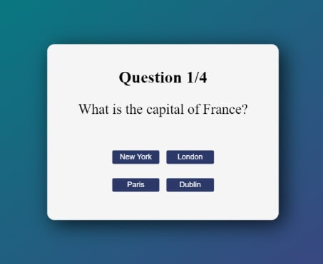

# Тестовое задание “Quiz”

# Техническое задание: 
Необходимо реализовать приложение, содержащее вопросы из разных сфер деятельности.

## Используемые технологии: 
- HTML
- CSS
- Javascript

## Описание: 
- Приложение должно содержать блок, внутри которого будет располагаться: вопрос, варианты ответов, счетчик, показывающий количество вопросов, кнопка перехода к следующему вопросу, в случае, если вопрос, содержит несколько вариантов ответа, пользователь должен быть об этом проинформирован.
- При выборе ответа, поле должно менять цвет, варьирующийся от корректности заданного значения (зеленый - ответ правильный, красный - ответ неправильный). 
- Переход к следующему вопросу должен осуществляться только после выбора варианта ответа.
- После окончания вопросов, пользователя необходимо проинформировать о количестве правильных ответов, так же должна появиться кнопка, позволяющая начать тест заново.

## Также проект предполагает: 
- Реализация адаптивной верстки.
- Необходимо применить все лучшие практики написания чистого, читаемого кода.

## Пример графического представления: 

## Примеры вопросов для заполнения: 
1. How many planets are in the solar system? (8, 9, 10)
2. What is the freezing point of water? (0, -5, -6)
3. What is the longest river in the world? (Nile, Amazon, Yangtze)
4. How many chromosomes are in the human genome? (42, 44, 46)
5. Which of these characters are friends with Harry Potter? (Ron Weasley, Draco Malfoy, Hermione Granger)
6. What is the capital of Canada? (Toronto, Ottawa, Vancouver)
7. What is the Jewish New Year called? (Hanukkah, Yom Kippur, Kwanzaa)